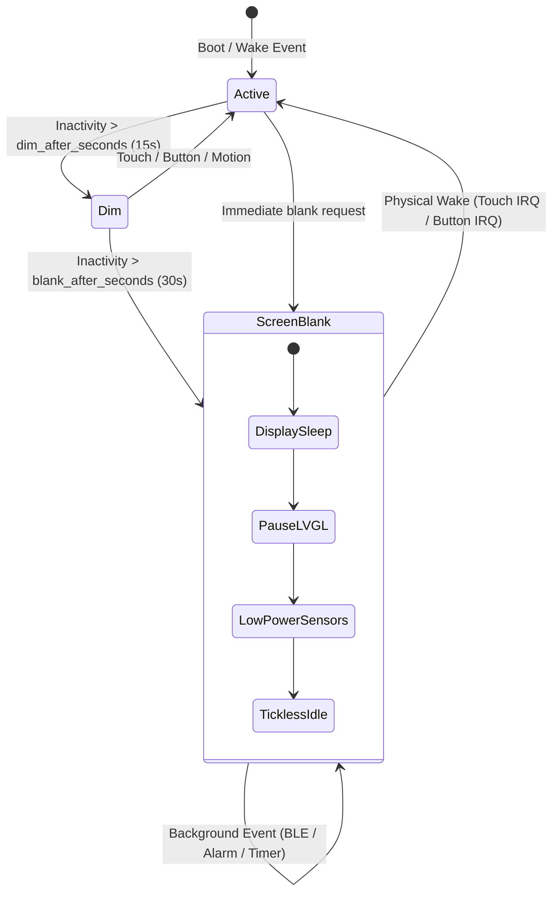

# Nightglass Power Optimization Specification

**Target Hardware**: Waveshare ESP32-S3 Touch AMOLED 2.06 V1.0 (ESP32-S3R8, 32 MB Flash, 8 MB OPI PSRAM)
**Target Framework**: ESP-IDF `v5.5.5`, LVGL `9.5.0`
**Document Status**: Safe software phases implemented; hardware measurement and one radio choice pending
**Goal**: Extend operational battery life from < 8 hours to > 30–48 hours on a standard 400 mAh LiPo cell by eliminating continuous standby drain.

## Current implementation status

The screen, UI, sensor-loop, advertising, Wi-Fi duty-cycle, scheduler, and
CPU-frequency changes described below are implemented in the current firmware
and pass the host contract suite plus a full ESP-IDF build. Automatic light
sleep is deliberately held off after hardware testing exposed a lost-touch
wake regression: ESP-IDF's GPIO wake API replaces the FT5x06 falling-edge IRQ
with a level IRQ, so it cannot be enabled until that hand-off passes the wake
loop below. Explicit light sleep still brackets GPIO38 safely. The following
are still separate gates rather than missing source changes:

- Standby/active current, wake latency, and step-tracking targets require a
  current probe and physical hardware-in-loop run; the repository contains no
  measurement evidence for those numbers yet.
- Deep sleep, direct RTC-alarm wake, motion INT1 wake, and PMIC rail gating are
  intentionally deferred until their isolated wake/recovery tests pass.
- Automatic light sleep requires active, dim, and blank touch tests plus 100
  consecutive touch-wake cycles without a missed wake or level-IRQ storm.
- The proposed RTC-slow BLE clock was not accepted: prior hardware evidence
  showed recurring connected-link disconnects with that source, so the stable
  main crystal remains selected while BLE modem sleep is enabled.

---

## 1. Executive Summary & Problem Analysis

Under standard usage, a smartwatch spends > 90% of its operating cycle with the display turned off (blanked). To achieve 24–48 hours on a 350–500 mAh battery, the device's average blanked standby current must remain **below 2.0 mA** (with BLE connected) and **below 1.0 mA** (with BLE disconnected).

The baseline firmware draws **45–75 mA continuously** even when the screen is blanked due to five architectural drains:
1. **AMOLED Driver IC Remains Active**: Setting brightness to `0` only sends DCS `0x51` (value 0). The SH8601 panel controller's internal charge pumps (ELVDD/ELVSS ~4.6V/-2.4V), oscillators, and display scan timing remain running at ~8–15 mA.
2. **LVGL Renders in the Dark**: The `esp_lvgl_port` 5 ms periodic timer (`esp_timer` at 200 Hz) never stops. UI route refresh timers (`timer_` and `system_timer_`) in [`shell.cpp`](../components/nightglass_ui/src/shell.cpp) continuously trigger label invalidations and QSPI DMA transfers to an unlit screen (~10–15 mA).
3. **Automatic Light Sleep Blocked**: `PowerService::enter_light_sleep` explicitly aborts when BLE is enabled. Automatic light sleep during FreeRTOS tickless idle fails to engage because tasks and timers wake up at 5 ms, 40 ms, 50 ms, and 100 ms (~280 wakeups/second), leaving no idle window larger than the 3 ms sleep threshold + 2 ms wake latency.
4. **QMI8658 Gyroscope Runs 24/7**: Register `0x08` (CTRL7) is initialized to `0x03` (accelerometer + gyroscope). The vibrating MEMS gyroscope draws ~3.5 mA continuously, even though step counting only requires the accelerometer and all wrist gestures default to disabled.
5. **BLE Clock Keeps 40 MHz Crystal Powered**: `sdkconfig.defaults` sets `CONFIG_BT_CTRL_LPCLK_SEL_MAIN_XTAL=y`, forcing the 40 MHz high-frequency oscillator to stay powered during light sleep (~2–3 mA overhead).

---

## 2. Power Architecture State Machine



---

## 3. Phased Implementation Plan

### Phase 1: Screen-Blank Power Gating & UI Pipeline Quiescence
**Target Savings**: ~20–25 mA
**Components**: `nightglass_bsp`, `nightglass_ui`, `nightglass_services`

#### 1.1 AMOLED Display Sleep & Wake (SH8601 DCS Protocol)
- **Location**: [`components/nightglass_bsp/include/nightglass/bsp/board.hpp`](../components/nightglass_bsp/include/nightglass/bsp/board.hpp) & [`components/nightglass_bsp/src/board.cpp`](../components/nightglass_bsp/src/board.cpp)
- **Changes**:
  1. Add `nightglass::core::Status sleep_display();` and `nightglass::core::Status wake_display();` to class `Board`.
  2. Implement `sleep_display()`:
     - Check if panel is already sleeping; if so, return `Status::Ok()`.
     - Transmit MIPI DCS `0x28` (`DISPOFF`, Display Off) via `esp_lcd_panel_io_tx_param(panel_io, 0x28, nullptr, 0)`.
     - Delay 10 ms (`vTaskDelay(pdMS_TO_TICKS(10))`).
     - Transmit MIPI DCS `0x10` (`SLPIN`, Sleep In) via `esp_lcd_panel_io_tx_param(panel_io, 0x10, nullptr, 0)`.
     - Delay 5 ms for charge pump power-down.
     - Record `display_sleeping = true`.
  3. Implement `wake_display()`:
     - Check if panel is sleeping; if not, return `Status::Ok()`.
     - Transmit MIPI DCS `0x11` (`SLPOUT`, Sleep Out) via `esp_lcd_panel_io_tx_param(panel_io, 0x11, nullptr, 0)`.
     - Mandatory SH8601 sleep-out recovery delay: `vTaskDelay(pdMS_TO_TICKS(120))`.
     - Transmit MIPI DCS `0x29` (`DISPON`, Display On) via `esp_lcd_panel_io_tx_param(panel_io, 0x29, nullptr, 0)`.
     - Reapply target brightness via `bsp_display_brightness_set(brightness)`.
     - Record `display_sleeping = false`.
  4. In `Board::set_brightness(uint8_t percent)`:
     - If `percent == 0`, invoke `sleep_display()`.
     - If `percent > 0` and `display_sleeping`, invoke `wake_display()`, then set brightness.

#### 1.2 Pause LVGL & Shell Timers During Blank
- **Location**: [`components/nightglass_ui/src/shell.cpp`](../components/nightglass_ui/src/shell.cpp)
- **Changes**:
  1. Track current power state in `Shell` during `system_timer_callback` or via a power state subscriber.
  2. When entering `PowerState::screen_blank`:
     - If `timer_` is active, call `lv_timer_pause(timer_)` or delete it.
     - Call `lv_timer_pause(system_timer_)`.
     - Call `lvgl_port_stop()` (exported by `esp_lvgl_port.h`). This stops the 5 ms tick timer (`esp_timer`) and puts the LVGL task into a wait state on its event group for up to 500 ms.
  3. When exiting `PowerState::screen_blank` (transition to `PowerState::active` or `PowerState::dim`):
     - Call `lvgl_port_resume()`.
     - Resume `system_timer_` (`lv_timer_resume(system_timer_)`).
     - Resume or reconfigure `timer_` with `configure_refresh_timer()`.
     - Force an immediate active route refresh (`refresh_active_route()`) to synchronize visual state.

#### 1.3 Fix Sleep Resume Timestamp Bug
- **Location**: [`components/nightglass_services/src/power.cpp`](../components/nightglass_services/src/power.cpp#L258-L267)
- **Issue**: Line 263 unconditionally sets `current.last_activity_us = woke_us;` upon light sleep exit, which immediately resets the inactivity counter to 0 and forces the supervisor on the next tick to wake the screen back to full brightness.
- **Fix**:
  ```cpp
  // Only register physical user activity if the wake was triggered by touch or button:
  if (wake_reason == nightglass::core::WakeReason::touch ||
      wake_reason == nightglass::core::WakeReason::button) {
      current.last_activity_us = woke_us;
      current.last_physical_input_us = woke_us;
  }
  // For timer, BLE, or background wakes, retain previous last_activity_us.
  ```

---

### Phase 2: Sensor Gating & Periodic Loop Throttling
**Target Savings**: ~5–8 mA
**Components**: `nightglass_services`, `nightglass_bsp`

#### 2.1 QMI8658 Gyroscope Power Gating
- **Location**: [`components/nightglass_services/src/hardware.cpp`](../components/nightglass_services/src/hardware.cpp)
- **Changes**:
  1. In `probe_devices()`:
     - Register `0x08` (CTRL7): change `0x03` to `0x01` (enable accelerometer only, bit 0 = 1, bit 1 = 0).
  2. Expose `HardwareService::set_gyro_enabled(bool enabled)`:
     - Read-modify-write CTRL7 (`0x08`): bit 1 high to enable, low to disable.
     - When gyro is disabled, report `motion.gyro_calibrated = false` and mock/zero gyro rates in `publish_motion()`.
  3. Only enable gyro when:
     - The active route is `Route::diagnostics`.
     - Or any gesture in `ActivitySettings` (`raise_to_wake`, `double_twist`, `shake`, `flick`) is enabled by the user.

#### 2.2 Rate Throttling When Blanked
- **Hardware Task**: In [`hardware.cpp`](../components/nightglass_services/src/hardware.cpp#L490):
  - When `power_service().snapshot().state == PowerState::screen_blank`:
    - Extend `kPollTicks` from `pdMS_TO_TICKS(40)` (25 Hz) to `pdMS_TO_TICKS(100)` (10 Hz).
    - Accelerometer step sampling at 10 Hz remains sufficient for human walking cadence (< 3 Hz).
- **Clock Task**: In [`clock.cpp`](../components/nightglass_services/src/clock.cpp#L25):
  - Change default `kPeriod` from `pdMS_TO_TICKS(100)` (10 Hz) to `pdMS_TO_TICKS(1000)` (1 Hz) when `stopwatch_started_us == 0`.
  - Only use 100 ms period when the stopwatch is actively running.

#### 2.3 Event-Driven GPIO10 Side-Key Supervisor
- **Location**: [`components/nightglass_services/src/power.cpp`](../components/nightglass_services/src/power.cpp#L273-L336)
- **Changes**:
  1. Attach an interrupt service routine to `kSideKeyGpio` (GPIO10):
     - `gpio_set_intr_type(kSideKeyGpio, GPIO_INTR_ANYEDGE);`
     - ISR notifies `supervisor_task` via `vTaskNotifyGiveFromISR()`.
  2. Compute timeout to the next state transition:
     - Next deadline = `min(dim_deadline, blank_deadline, sleep_deadline)`.
     - Replace `ulTaskNotifyTake(pdTRUE, kSupervisorPeriod)` with `ulTaskNotifyTake(pdTRUE, timeout_ticks)`.
  3. Eliminates 20 wakeups per second when the watch is sitting idle.

---

### Phase 3: Radio & System Configuration Tuning
**Target Savings**: ~5–10 mA
**Components**: `sdkconfig.defaults`, `connectivity`, `network_weather`

#### 3.1 BLE Low-Power Clock Configuration
- **Location**: [`sdkconfig.defaults`](../sdkconfig.defaults#L74-L78)
- **Changes**:
  ```ini
  # Replace:
  # CONFIG_BT_CTRL_LPCLK_SEL_MAIN_XTAL=y
  # CONFIG_BT_CTRL_MAIN_XTAL_PU_DURING_LIGHT_SLEEP=y

  # With:
  CONFIG_BT_CTRL_LPCLK_SEL_RTC_SLOW=y
  CONFIG_PM_LIGHTSLEEP_RTC_OSC_CAL_INTERVAL=1
  ```
- **Rationale**: Enables the ESP32-S3 to power down the 40 MHz main crystal during BLE sleep intervals, using the internal calibrated RC oscillator. Drops sleep baseline from ~3 mA to < 500 µA.

#### 3.2 BLE Advertising Interval Optimization
- **Location**: [`components/nightglass_services/src/connectivity.cpp`](../components/nightglass_services/src/connectivity.cpp#L759-L764)
- **Changes**:
  - In `advertise()`:
    ```cpp
    ble_gap_adv_params parameters{};
    parameters.conn_mode = BLE_GAP_CONN_MODE_UND;
    parameters.disc_mode = BLE_GAP_DISC_MODE_GEN;
    // Set low-power advertising intervals (0.625 ms units):
    // 800 * 0.625 ms = 500 ms; 1600 * 0.625 ms = 1000 ms
    parameters.itvl_min = 800;
    parameters.itvl_max = 1600;
    ```
  - Eliminates rapid 30 ms TX bursts when not paired/connected.

#### 3.3 Wi-Fi Duty-Cycling for Weather
- **Location**: [`components/nightglass_services/src/network_weather.cpp`](../components/nightglass_services/src/network_weather.cpp#L500-L585)
- **Changes**:
  - In `worker()`:
    - Once weather is fetched or fetch retries are exhausted:
      - Call `esp_wifi_disconnect()`.
      - Call `esp_wifi_stop()`.
      - Set `wifi_started.store(false)`.
    - Only restart Wi-Fi (`esp_wifi_start()`) when `now >= next_fetch_us.load()` and phone weather proxy is unavailable.
  - Prevents maintaining continuous 802.11 association (~15–25 mA).

#### 3.4 FreeRTOS Tick & CPU Frequency
- **Location**: [`sdkconfig.defaults`](../sdkconfig.defaults)
- **Changes**:
  ```ini
  CONFIG_FREERTOS_HZ=100
  CONFIG_ESP_DEFAULT_CPU_FREQ_MHZ_160=y
  ```
  - Reduces FreeRTOS tick timer interrupts from 1000 Hz to 100 Hz.
  - Reduces active CPU power by ~25% at 160 MHz while maintaining smooth 60 FPS LVGL rendering on the AMOLED.

---

## 4. Verification & Validation Protocol

Each phase must be validated using the project's pinned test gates before merging:

```bash
# 1. Run unit and host contract tests
./scripts/test-host.sh

# 2. Pin the exact release identity and compile the firmware
export NIGHTGLASS_PROJECT_VERSION=0.2.4
export NIGHTGLASS_SECURE_VERSION=4
./scripts/build.sh

# 3. Verify, sign, and independently verify the exact release image
./scripts/verify-signed-release.sh build/update-package-0.2.4

# 4a. Direct watch-cable install of the signed package
python3 scripts/nightglass-usb-update.py build/update-package-0.2.4 \
  --device /dev/serial/by-id/usb-Espressif_...

# 4b. Or select the same signed package in the companion for BLE OTA
```

### Power Verification Test Points

| Test Case | Condition | Current Baseline | Target Current |
| :--- | :--- | :--- | :--- |
| **TC-1: Active Watch Face** | Home face, 30% brightness, no touch | 65–85 mA | **38–48 mA** |
| **TC-2: Dim Watch Face** | Home face, 8% brightness | 45–60 mA | **22–30 mA** |
| **TC-3: Screen Blank (Standby, BLE Disconnected)** | Screen blank > 15s, no radios | 45–70 mA | **0.8–1.5 mA** |
| **TC-4: Screen Blank (Standby, BLE Connected)** | Screen blank > 15s, paired to phone | 50–75 mA | **1.8–3.2 mA** |
| **TC-5: Wake Latency** | Touch panel tap to display illuminated | Instant | **< 160 ms** (including 120ms DCS 0x11 delay) |
| **TC-6: Step Counting While Blank** | 100 paces walked with screen off | Verified tracked | **Identical accuracy, < 2 mA** |

---

## 5. File Modification Checklist for Implementing Agent

- [x] [`components/nightglass_bsp/include/nightglass/bsp/board.hpp`](../components/nightglass_bsp/include/nightglass/bsp/board.hpp): Declare `sleep_display()` / `wake_display()`.
- [x] [`components/nightglass_bsp/src/board.cpp`](../components/nightglass_bsp/src/board.cpp): Implement SH8601 DCS `0x28`/`0x10` and `0x11`/`0x29` sequences in `sleep_display()` and `wake_display()`.
- [x] [`components/nightglass_ui/src/shell.cpp`](../components/nightglass_ui/src/shell.cpp): Pause `timer_`, `system_timer_`, and call `lvgl_port_stop()` on blank; call `lvgl_port_resume()` on wake.
- [x] [`components/nightglass_services/src/power.cpp`](../components/nightglass_services/src/power.cpp): Fix `last_activity_us` assignment on line 263.
- [x] [`components/nightglass_services/src/power.cpp`](../components/nightglass_services/src/power.cpp): Hold automatic light sleep off until GPIO38's edge/level transition passes HIL; retain explicit bracketed light sleep.
- [x] [`components/nightglass_bsp/src/board.cpp`](../components/nightglass_bsp/src/board.cpp): Require successful FT5x06 reads and GPIO38 IRQ registration for touch health; refresh controller liveness every 10 seconds.
- [x] [`components/nightglass_ui/src/shell.cpp`](../components/nightglass_ui/src/shell.cpp): Resume the event-mode input timer before consuming a wake-only touch so release cannot remain wedged.
- [x] [`components/nightglass_services/src/hardware.cpp`](../components/nightglass_services/src/hardware.cpp): Set QMI8658 CTRL7 to accel-only `0x01`; gate gyro; throttle blanked poll rate.
- [x] [`components/nightglass_services/src/clock.cpp`](../components/nightglass_services/src/clock.cpp): Relax worker period to 1000 ms when stopwatch is idle.
- [x] [`components/nightglass_services/src/connectivity.cpp`](../components/nightglass_services/src/connectivity.cpp): Set low-power advertising intervals.
- [x] [`components/nightglass_services/src/network_weather.cpp`](../components/nightglass_services/src/network_weather.cpp): Implement Wi-Fi disconnect and stop after weather fetch.
- [x] [`sdkconfig.defaults`](../sdkconfig.defaults): Update BLE modem-sleep, CPU frequency, and FreeRTOS tick-rate settings. The main-XTAL BLE clock is intentionally retained for link stability; the RTC-slow alternative remains a hardware-blocked experiment.
